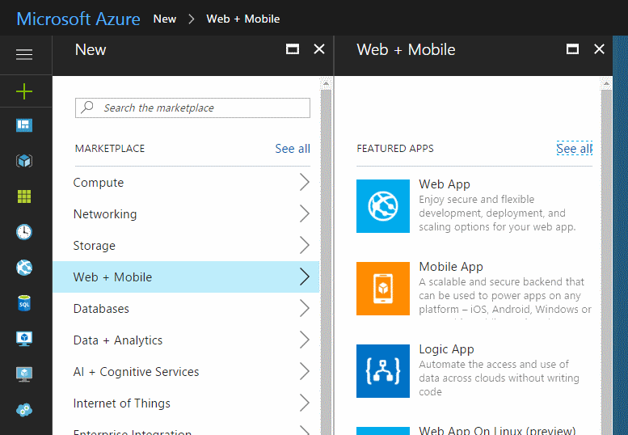
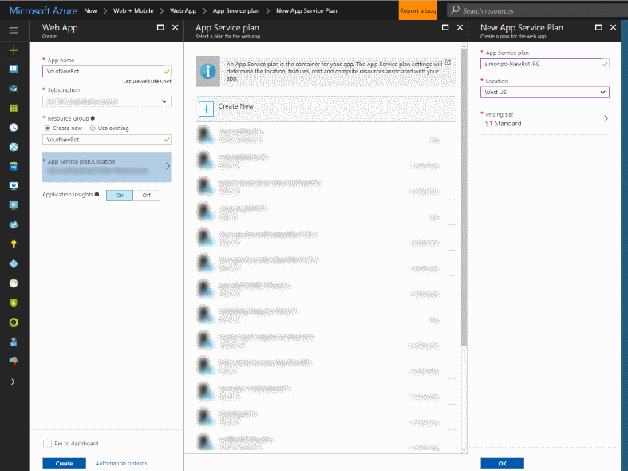
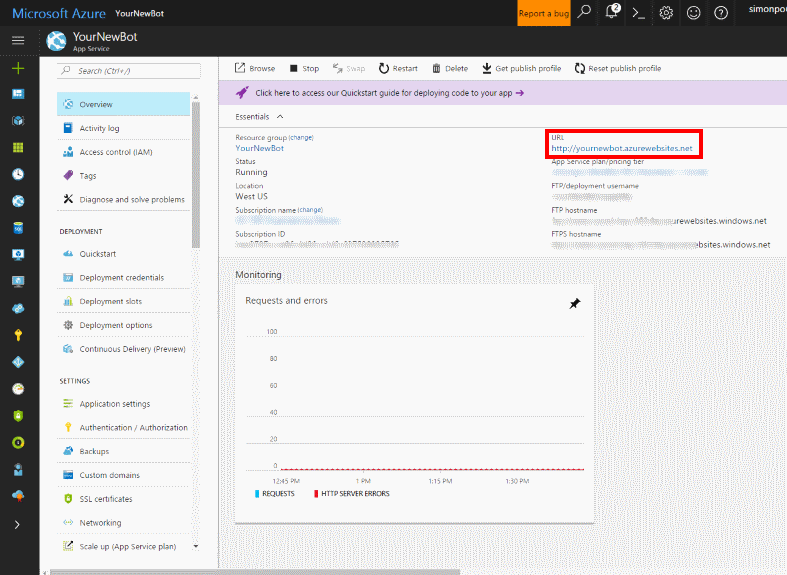
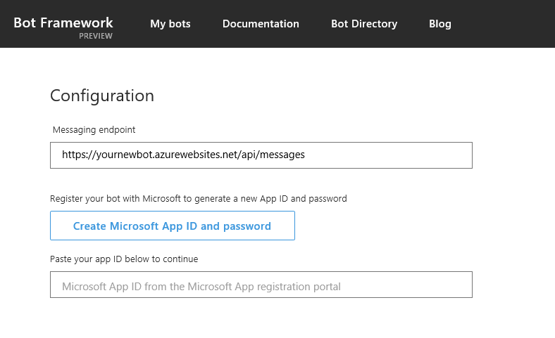
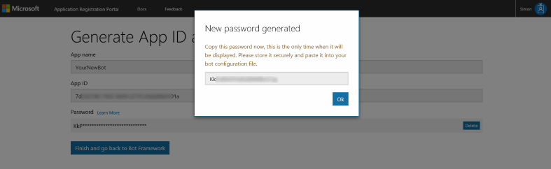

# Setup Guide #

## Your Azure account ##

You'll need an Azure account to create and manage your Bot. If you don't already have one, you can activate a free trial at [https://azure.microsoft.com/free/](https://azure.microsoft.com/free/).

Sign in to the Azure portal at https://portal.azure.com

## Walking through the BotScaffold Generator ##

The BotScaffold generator walks asks questions, and uses the answers you provide to create a Node.js application  you can use as the skeleton of your bot. 

While it does some of the grunt work, you will need to configure some Azure services to feed it the required information. 

The first four questions ask for the name of the app that you want to build, a brief description of the bot, your name and your email address - all of which we be written into the config files. Once you've got that out of the way, we get to the interesting pieces. The sections below tell you how to create the Azure services you need to answer them. 

### Enter your bot ID here

Sign into Azure, and click the **green +** sign in the left menu to create a new service. 

Select **Web + Mobile**, then choose **Web App**. 

 

Fill out the form to create the Web App, entering a new **App name**, selecting a **Subscription**, and choosing either a new or existing **Resource Group**. Select an **App Service Plan/Location** either close to you, or to where most users of your Bot will be. Finally, choose whether to enable **Application Insights** (recommended).

 

Your app will be created and validated, and you will be returned to the Azure Dashboard while the app is deployed. After a few seconds the  App Overview screen will display: 

 

Take note of the URL highlighted with the red box above, you'll need this shortly. 

In a new browser window, go to , sign in, click the **My bots** link on the homepage navigation bar, and select the **Create a bot** button. Here, we're going to create and register a new bot, and gather the information we need to put into the **Botscaffold** generator. You will need to refer to information from the Web App you created on the Azure Portal to create your bot. 

Follow the instructions on the **Tell us about your bot** form to create your bot. In the **Configuration** section, use the URL of your Azure Web App to create a messaging endpoint, replacing http:// with https:// and adding /api/messages to the end, like so:

Select the **Create Microsoft App ID and Password** button, and a new browser window will open showing your **App ID** and button to generate a **Password**. Take careful note of the password that is generated, this is the only time you can see it displayed. 

You now have the first two pieces of information you need to answer the Botscaffold generator's questions - paste the **App ID* and **App Password** into the generator:

 

 

 
