# Setup Guide #

## Your Azure account ##

You'll need an Azure account to create and manage your Bot. If you don't already have one, you can activate a free trial at [https://azure.microsoft.com/free/](https://azure.microsoft.com/free/).

Sign in to the Azure portal at https://portal.azure.com

## Walking through the BotScaffold Generator ##

The BotScaffold generator asks a series of questions, and uses your answers to create a Node.js application that you can use as the skeleton of your bot. 

While it does some of the grunt work, you will need to configure some Azure services to feed it the required information. 

The first four questions ask for the name of the app you want to build, a brief description of the bot, your name and your email address - all of which it writes into the config files. Once you've got that out of the way, we get to the interesting questions. The sections below tell you how to create the Azure services you need to answer them. 

### Enter your App ID / Enter your App Password

Sign into Azure, and click the **green +** sign in the left menu to create a new service. 

Select **Web + Mobile**, then choose **Web App**. 

 

Fill out the form to create the Web App, entering a new **App name**, selecting a **Subscription**, and choosing either a new or existing **Resource Group**. Select an **App Service Plan/Location** either close to you, or to where most users of your Bot will be. Finally, choose to enable **Application Insights** (required for this version of the Botscaffold generator).

 

Your app will be created and validated, and you will be returned to the Azure Dashboard while the app is deployed. After a few seconds the  App Overview screen will display: 

 

Take note of the URL highlighted with the red box above, you'll need this shortly. 

In a new browser window, go to [https://dev.botframework.com/](https://dev.botframework.com/), sign in, click the **My bots** link on the homepage navigation bar, and select the **Create a bot** button. Here, we're going to create and register a new bot, and gather the information we need to put into the **Botscaffold** generator. You will need to refer to information from the Web App you created on the Azure Portal to create your bot. 

Follow the instructions on the **Tell us about your bot** form to create your bot. In the **Configuration** section, use the URL of your Azure Web App to create a messaging endpoint, replacing http:// with https:// and adding /api/messages to the end, like so:


Select the **Create Microsoft App ID and Password** button, and a new browser window will open showing your **App ID** and button to generate a **Password**. Take careful note of the password that is generated, this is the only time you can see it displayed. 


After you've saved the Password somewhere safe, click **OK** and then **Finish and go back to Bot Framework**. 

You now have the first two pieces of information you need to answer the Botscaffold generator's questions: paste the **App ID** and **App Password** into the generator when prompted, which will save them into the **.vscode\launch.json** file as environment variables for use in local bot testing. This file is included in the **.gitignore** file, and will not be uploaded to GitHub. 

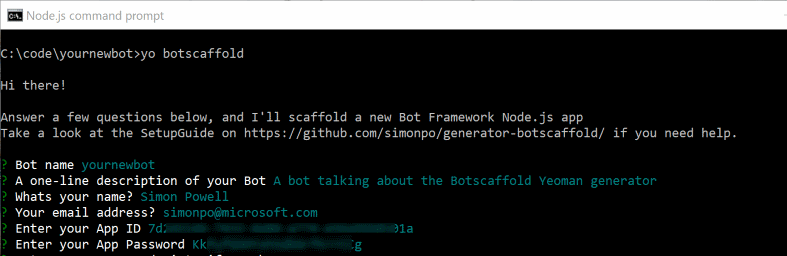

Back on the **Tell us about your bot** page at dev.botframework.com, you can set up Analytics for your bot via Azure Application Insights. See [this document](https://docs.microsoft.com/en-us/bot-framework/portal-analytics-overview#enable-analytics) for details. If you enabled Application Insights during creation of your Web App, the AppInsights service has been set up for your bot already, and you can find your AppInsights instrumentation key in the Azure portal. The **Instrumentation Key** is located under the Essentials section on the Overview tab:

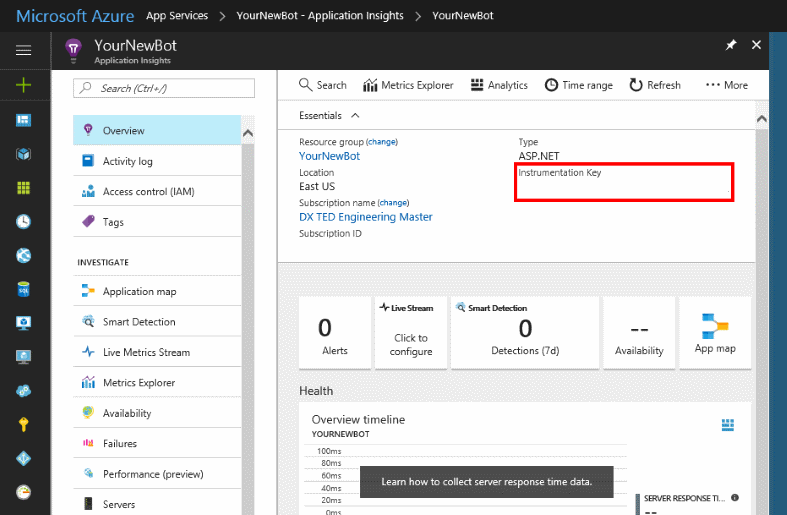

You'll need to generate an **AppInsights API key**, so click the **API Access** tab on the menu and then **+ Create API Key**. and follow the instructions to do that. Make sure you copy this key somewhere safe, as it's not stored, and after you close this blade you won't be able to see it again.

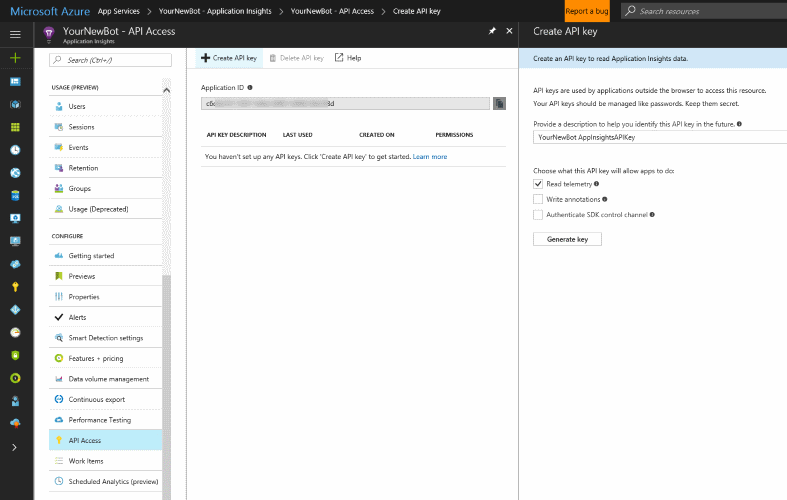

Once you've generated the key, copy and paste the Application ID and API Key into the **Tell us about your bot** form, review and accept the Terms of Use, Privacy Statement and Code of Conduct, and select **Register** to create your bot. 

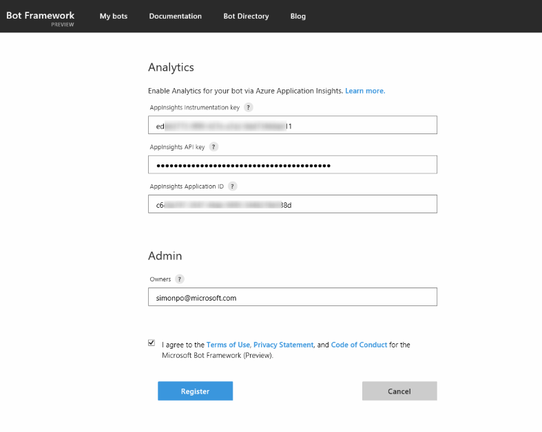

You now have the third piece of information you need to answer the Botscaffold generator's questions: paste the **AppInsights Instrumentation Key** into the generator when prompted.

Congratulations - you've completed the first step of the process. Next, we'll set up LUIS so your bot can have an intelligent conversation. 

### Enter your LUIS endpoint ###

In another new browser window, sign in at [https://luis.ai](https://luis.ai) and select the **New App** option. A pop-up will ask you for the name 

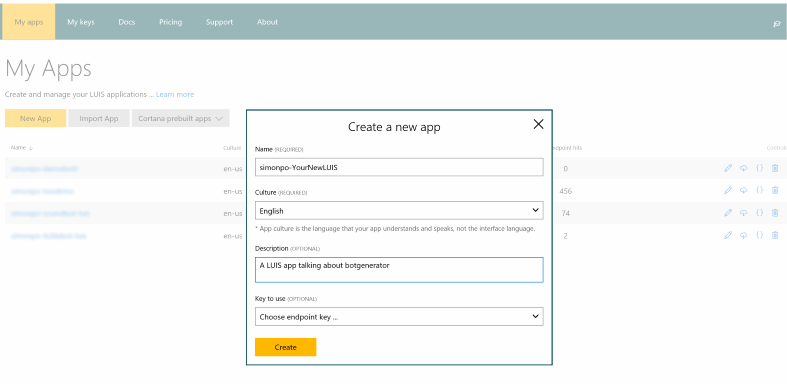

Your new LUIS app will be created, and your Dashboard displayed. Next, you will need to create three sample Intents named as follows:

- Greeting
- Help
- AboutTheBot

Follow the instructions in LUIS to create these Intents and their associated utterances, like this:

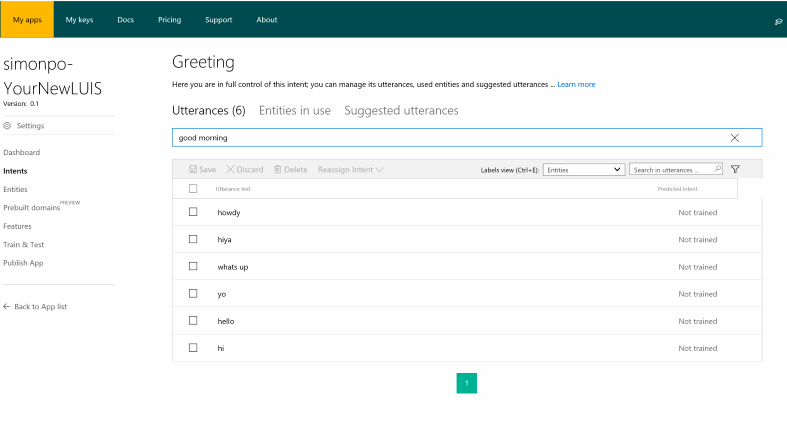

Once all three Intents are created, select **Train and Test** from the left menu, select **Train your Application**, and then test your model following the instructions on the screen

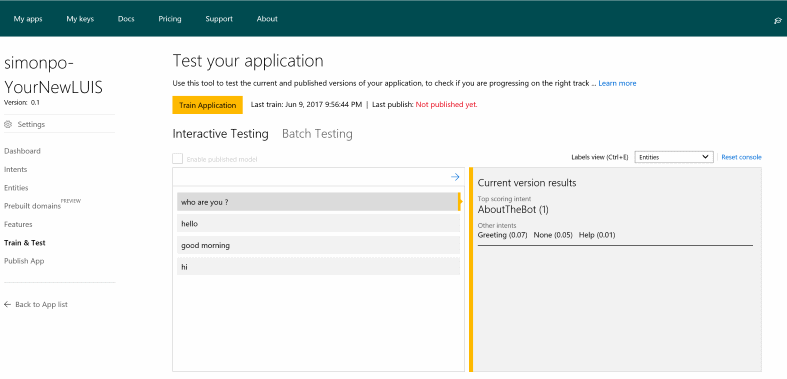

When you're happy with your Intents and the test results, select **Publish** from the left menu, and complete the required information on the form

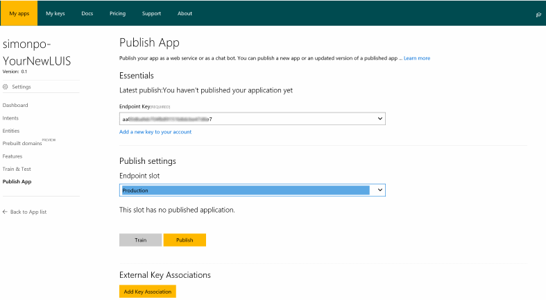

After choosing whether you want verbose logging, to use Bing search, and the timezone you'd like associated with your model, press the Publish button. Once you model is verified and published, you can copy the **Endpoint URL** and enter it into the Botscaffold generator. 

### Enter your LUIS embed code ###

We're nearly done with setup - you need to obtain a LUIS embed code, which the generator will insert into an HTML file hosted in your Azure Web App to act as a web-based chat client.  

Return to your bot at https://dev.botframework.com/ and select the **CHANNELS** menu option. By default, two channels have been created for you, Skype and Web Chat. 

Select the **Edit** link next to **Web Chat** and select **Add a new site**. Enter a name for your new site. 

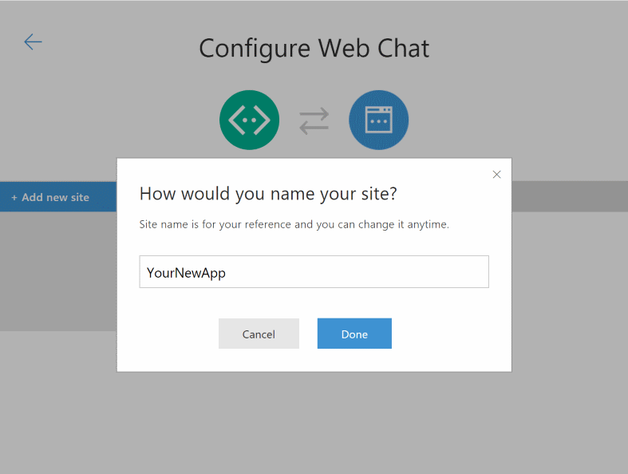

On the following screen, click **Show** to reveal the first hidden key

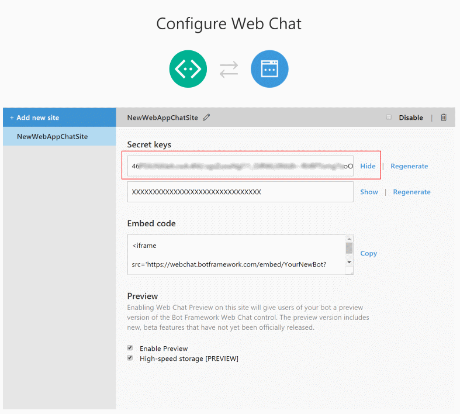

Use copy and paste to create your Embed code, replacing the text YOUR_SECRET_HERE in the following snippet with your own Secret Key 

```
<iframe src='https://webchat.botframework.com/embed/YourNewBot?s=YOUR_SECRET_HERE'></iframe>
```
Paste the entire iframe string into the Botscaffold generator.

Finally, Botscaffold will ask you to confirm the directory where you'd like to save your files.  The generator will now build the framework of the Bot for you. 

### Upload your Bot to GitHub ###

GitHub provides an extremely convenient mechanism both for managing your source code, and deploying your Bot code to your Azure Web Service. First, we'll need to upload your code to GitHub. 

- Sign in at [github.com](https://github.com)
- Create a new repo
- From the local directory containing your code, enter these commands: 

```
git init
git add .
git commit -m "first commit"
git remote add origin <your git repo url>
git push -u origin master
```
Your Bot code will be deployed to GitHub, and you will be able to sync future changes through the usual `git` process.

### Set Environment Variables in Azure ###

Before you upload your bot to your Azure Web Service for testing, you should configure Environment Variables, where you can store the app-specific details that you don't want to store in your source code. 

Return to the [Azure Portal]((https://portal.azure.com), navigate to your Web App, and from the **Application Settings** tab, enter the following Key/Value pairs under the APPINSIGHTS_INSTRUMENTATIONKEY that has already been created:

- MY_APP_ID
- MY_APP_PASSWORD
- MY_LUIS_MODEL 

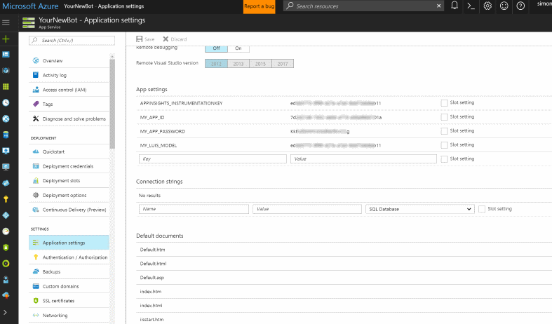

You can find the correct values in your .vscode\launch.json file, if you need. 

Next, configure your Web App to pull it's source code directly from GitHub. Select **Deployment Options** from the navigation menu, select **GitHub** from the list of source providers, and configure your login details, repo, and branch as appropriate

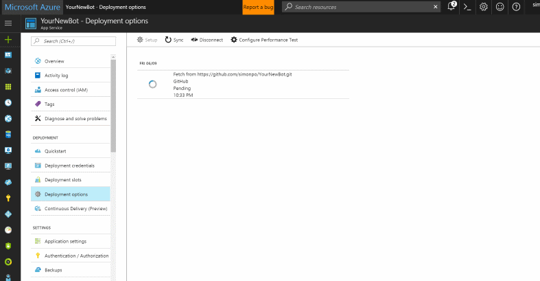

Your package will be pulled from GitHub into Azure automatically, and will automatically update when you push changes from your local repo up to GitHub in future. The Azure Web App will automatically be deployed to Azure once synchronised, and your bot code is now running in Azure. Congratulations!

### Testing your Bot with the Bot Framework Emulator ### 

To check that all is well, open the **Bot Framework Emulator** that you installed earlier. At the top of the screen, enter the URL of your **Messaging Endpoint**, your **App ID** and your **App Secret**. 

Press the **Connect** button, and begin a conversation with your Bot. You'll see debug information displayed in the Details and Log windows on the right.  


